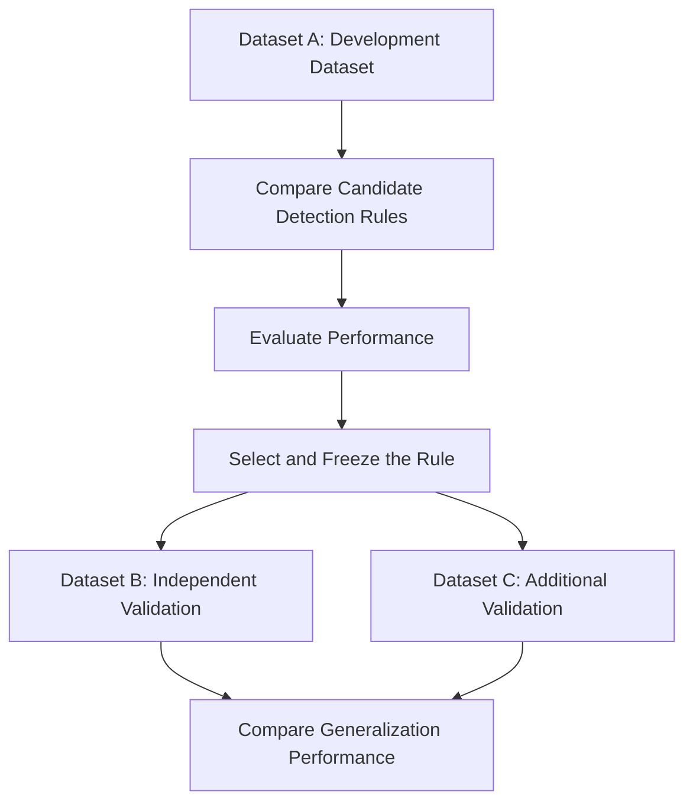

# eDNA Low-Abundance Species Detection

> Evaluating whether low-abundance fish detections in eDNA metabarcoding data represent real biological signals or background noise.

## Project Status

Research in progress.

This repository will contain the code, documentation, and results for a study comparing different methods for identifying reliable low-abundance species detections in fish eDNA metabarcoding datasets.

## Research Question

How can we determine whether a low-abundance fish detection in eDNA metabarcoding data is reliable?

## Why This Matters

Environmental DNA metabarcoding can detect many fish species from DNA collected in water samples.

However, detections with only a small number of reads are difficult to interpret. A low read count may represent:

- a genuinely rare species;
- a species present at a very low concentration;
- contamination between samples;
- sequencing or PCR error;
- tag jumping or index misassignment;
- background signal also found in negative controls.

Removing all low-read detections may cause real species to be missed. Keeping all of them may increase false-positive detections.

This project therefore examines which detection rules can distinguish real low-abundance signals from noise and whether those rules generalize to independent datasets.

## Dataset Similarity and Distribution Analysis

Before evaluating detection rules in detail, Dataset A and Dataset B will first be compared using basic characteristics shared across the datasets.
The analysis will focus initially on factors such as:

- read-count distributions;
- sequencing depth;
- replicate structure;
- negative-control background;
- other experimentally relevant variables that are consistently available across datasets.

This preliminary analysis will help characterize how similar or different the two datasets are.
The purpose is not to exclude Dataset B based on these differences, but to investigate whether differences between datasets can help explain changes in detection performance during external validation.
 

## Study Design

The study follows a development-and-external-validation design.



### Step 1: Development using Dataset A

Dataset A will be used to:

1. examine the distribution of read counts;
2. implement candidate detection rules;
3. compare the rules using predefined evaluation metrics;
4. select a final rule;
5. freeze the rule before examining the validation results.

### Step 2: Analysis Freeze

After the final rule has been selected using Dataset A, its parameters and decision process will be fixed.

The frozen rule will not be adjusted to improve its performance on Dataset B or Dataset C.

This step is intended to reduce overfitting and provide a fair test of whether the rule generalizes to new data.

### Step 3: External Validation

The frozen rule will be applied unchanged to independent datasets.

Performance on Dataset B and, where feasible, Dataset C will be compared with performance on Dataset A.

The analysis will examine:

- whether overall performance decreases;
- which types of false positives and false negatives occur;
- whether some detection rules are more stable across datasets;
- how differences in experimental conditions affect generalization.

## Candidate Detection Rules

The following types of detection rules will be compared.

### 1. Read-Count Threshold

A species is considered detected when its read count is equal to or greater than a fixed threshold.

Example:

```text
Detected if read count >= 10
```

### 2. Relative-Abundance Threshold

A species is considered detected when its reads represent at least a specified proportion of all reads in the sample.

Example:

```text
Detected if relative abundance >= 0.01%
```

### 3. Replicate-Based Rule

A species is considered detected only when it appears in a minimum number of PCR or technical replicates.

Example:

```text
Detected if present in at least 2 of 3 replicates
```

### 4. Negative-Control-Based Rule

A detection is evaluated relative to the background signal observed in negative controls.

Example:

```text
Detected if the sample read count is sufficiently greater
than the maximum read count in the negative controls
```

### 5. Combined Rule

Multiple forms of evidence are considered together.

A combined rule may use:

- read count;
- relative abundance;
- replicate consistency;
- negative-control signal.

The exact combined rule will be defined using Dataset A and frozen before external validation.

### 6. Decision Tree-Based Rule

A decision tree will be trained using Dataset A to identify combinations of features that distinguish reliable detections from false or background detections.
Candidate features may include:

- read count;
- relative abundance;
- replicate consistency;
- negative-control signal;
- other experimentally relevant variables available consistently across datasets.

The decision tree will be evaluated using an appropriate validation procedure within Dataset A. After model selection, the final tree and its parameters will be frozen before external validation.
The frozen decision tree will then be applied unchanged to Dataset B to evaluate whether a machine-learned decision rule generalizes across independent datasets.
The decision tree will also be compared with manually defined rule-based methods in terms of Precision, Recall, F1 Score, false positives, false negatives, and cross-dataset stability.
 

## Evaluation

Where ground-truth species composition is available, each species-by-sample prediction will be classified as:

| Classification | Meaning |
|---|---|
| True Positive | The species is present and correctly detected |
| False Positive | The species is absent but incorrectly detected |
| False Negative | The species is present but not detected |
| True Negative | The species is absent and correctly excluded |

The main evaluation metrics will include:

### Precision

The proportion of reported detections that are correct.

```text
Precision = TP / (TP + FP)
```

### Recall

The proportion of truly present species that are detected.

```text
Recall = TP / (TP + FN)
```

### F1 Score

The harmonic mean of precision and recall.

```text
F1 = 2 × Precision × Recall / (Precision + Recall)
```

False-positive and false-negative counts will also be examined directly because the two types of error may have different biological consequences.

## Main Hypothesis

Fixed read-count thresholds may perform well on the dataset used to select them but may lose performance when sequencing depth or background noise differs across datasets.

Rules that incorporate replicate consistency or negative controls may show more stable performance during external validation.

This is a hypothesis to be tested, not an assumed conclusion.

## Planned Repository Structure

```text
eDNA-low-abundance-detection/
├── README.md
├── data/
│   ├── raw/
│   ├── processed/
│   └── metadata/
├── notebooks/
├── src/
│   ├── data_processing/
│   ├── detection_rules/
│   ├── evaluation/
│   └── visualization/
├── tests/
├── results/
│   ├── tables/
│   └── metrics/
├── figures/
├── docs/
└── requirements.txt
```

Large raw sequencing files may not be stored directly in this repository. Where possible, the repository will instead provide accession numbers, download instructions, and scripts for reproducing the analysis.

## Reproducibility

The project aims to make the analysis reproducible by documenting:

- dataset sources and accession numbers;
- metadata interpretation;
- preprocessing decisions;
- candidate rule definitions;
- evaluation criteria;
- the analysis-freeze date and version;
- software and package versions;
- random seeds, where applicable;
- generated tables and figures.

The frozen detection rule will be recorded using a Git commit or tagged release before external validation.

## Current Progress

- [x] Define the main research question
- [x] Identify major categories of detection rules
- [x] Design the Dataset A → Freeze → Dataset B/C workflow
- [ ] Finalize Dataset A
- [ ] Finalize independent Dataset B
- [ ] Assess the feasibility of Dataset C
- [ ] Create a common data schema
- [ ] Implement baseline detection rules
- [ ] Implement evaluation metrics
- [ ] Compare candidate rules using Dataset A
- [ ] Freeze the final rule
- [ ] Perform external validation
- [ ] Conduct error and failure analysis
- [ ] Prepare final figures, poster, and presentation

## Research Principles

This project follows four main principles:

1. Compare simple baseline rules before using more complex methods.
2. Define evaluation criteria before selecting the final rule.
3. Freeze the selected rule before external validation.
4. Report both successful and unsuccessful generalization results.

## Limitations

Potential limitations include:

- differences in marker regions and primers;
- differences in sequencing depth;
- variation in PCR replication;
- inconsistent availability of negative controls;
- differences in mock-community composition;
- incomplete or differently defined ground truth;
- variation in preprocessing pipelines between studies.

These differences will be documented and considered when interpreting cross-dataset performance.

## Expected Outputs

The planned outputs are:

- reusable Python code for applying detection rules;
- standardized evaluation scripts;
- comparisons of rule performance;
- external-validation results;
- figures showing precision, recall, F1, false positives, and false negatives;
- a reproducible analysis record;
- a research poster and presentation.

## Author

Miho Totsuka

Student researcher interested in bioinformatics, environmental DNA, and computational biology.
